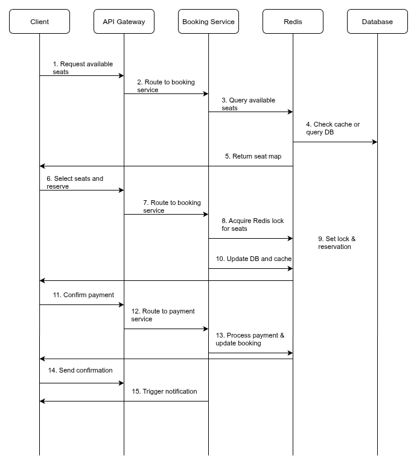
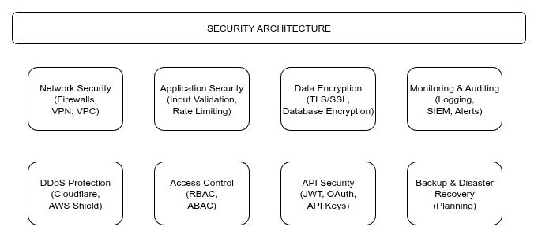

# Cinema Ticket Booking API

## About

A Cinema Ticket Booking API for case study using Go, Gin, Swaggo, and PostgreSQL. Main features for this case study are:

- User authentication and authorization with JWT
- CRUD operations for movie screenings

## Personal

Made by [Tirza Sarwono](https://www.linkedin.com/in/tirzasrwn/).

## Stack

- Go 1.25
- Gin Web Framework
- Swagger API Documentation with Swaggo
- JWT Authentication
- PostgreSQL
- Docker & Docker Compose

## System Design


## Detailed Component Breakdown


## Sequence Diagram



## Scalability Feature


## Security Layer



## Flowchart


## Entity Relationship Diagram (ERD)


## Requirement

- Unix based OS (for make command)
- Docker
- Docker Compose
- Make
- Go (for development)

## Running

### Using Docker Compose (Recommended)

```sh
# Start all services
make up
# Stop all services
make down
```

### Running Specific Services

You can run individual services separately:

```sh
# Build and start specific services
make docker_db_build    # Database
make docker_db_start
make docker_db_stop

make docker_be_build    # Backend
make docker_be_start
make docker_be_stop
```

## API Routes


This API documentation uses Swagger. Here are the main routes:

| Route              | Method | Description                            | Authentication |
| ------------------ | ------ | -------------------------------------- | -------------- |
| `/login`           | POST   | Authenticate user and return JWT token | Public         |
| `/screenings`      | GET    | Get all available screenings           | JWT Required   |
| `/screenings`      | POST   | Create new screening                   | JWT + Admin    |
| `/screenings/{id}` | GET    | Get specific screening details         | JWT Required   |
| `/screenings/{id}` | PUT    | Update screening information           | JWT + Admin    |
| `/screenings/{id}` | DELETE | Delete screening                       | JWT + Admin    |

Swagger API documentation can be found at [http://localhost:4000/swagger/index.html](http://localhost:4000/swagger/index.html).

Postman Collection is available in the [`./docs/`](./docs/postman_collection.json) directory.

### Feature and Route Correlations

- **User Authentication**
  - Login: `POST /login`

- **Admin Operations**
  - Manage screenings: All `/screenings` endpoints

## Service Details

### Ports

| Service    | Port | Description     |
| ---------- | ---- | --------------- |
| Backend    | 4000 | Main API server |
| PostgreSQL | 5432 | Database        |

### Default Credentials

- **API Test User**

  ```sh
  email: admin@cinema.com
  password: password
  ```

- **Database**

  ```sh
  host: localhost
  port: 5432
  username: postgres
  password: postgres
  database: cinema_ticket_db
  ```

## Database Migration

Database migrations are automatically applied when starting with Docker Compose. SQL script is in [init_tables.sql](./database/migrations/init_tables.sql) .

## Answer for point A

### Gambaran Sistem dan Alur Pengguna (Flowchart)

Sistem pembelian tiket bioskop online ini dirancang untuk memberikan pengalaman yang mudah dan aman bagi pengguna. Alur utama dimulai saat pelanggan mencari jadwal film, di mana mereka dapat memilih kota, bioskop, serta tanggal dan waktu tayang yang diinginkan. Setelah menemukan film yang cocok, mereka akan masuk ke tahap pemilihan kursi. Sistem akan menampilkan tata letak kursi teater secara visual, dan pelanggan dapat memilih kursi yang masih kosong. Setelah memilih kursi, pelanggan melanjutkan ke proses pembayaran, di mana mereka dapat memilih berbagai metode pembayaran yang tersedia. Setelah pembayaran diverifikasi, sistem akan mengirimkan konfirmasi dan e-ticket melalui email atau SMS. Proses ini dirancang agar sederhana dan intuitif, bahkan bagi orang yang tidak terbiasa dengan teknologi.

### Solusi Teknis: Pemilihan Kursi, Restok, dan Refund

#### Sistem Pemilihan Tempat Duduk

Sistem ini menggunakan kombinasi PostgreSQL dan Redis yang didukung oleh bahasa pemrograman Golang. Saat pelanggan memilih kursi, sistem akan mencoba "mengunci" kursi tersebut di Redis menggunakan SETNX (Set if Not Exists) selama 10-15 menit. Ini berfungsi sebagai soft lock yang mencegah pelanggan lain memilih kursi yang sama secara bersamaan. Kemudian, proses reservasi di database PostgreSQL akan dilanjutkan dengan menggunakan strategi Optimistic Locking yang memanfaatkan field version di tabel seats. Setiap kali status kursi diubah, nilai version akan bertambah. Jika ada dua permintaan yang mencoba mengubah kursi yang sama secara bersamaan, permintaan yang version-nya lebih rendah (sudah kedaluwarsa) akan gagal, memastikan hanya satu transaksi yang berhasil. Selain itu, WebSocket digunakan untuk memberikan pembaruan real-time ke semua klien, sehingga pelanggan dapat melihat kursi yang baru saja dikunci atau dibeli oleh orang lain.

#### Sistem Restok Tiket

Sistem ini mengelola restok tiket yang sudah terjual maupun yang masih dalam reservasi. Jika pelanggan tidak menyelesaikan pembayaran dalam waktu 10-15 menit, job scheduler yang berjalan di background akan secara otomatis melepaskan reservasi tersebut. Kursi yang tadinya berstatus reserved akan diubah kembali menjadi available di database, dan nilai version-nya juga akan diperbarui. Selain itu, sistem secara rutin memantau kapasitas kursi yang tersedia dan dapat mengirimkan notifikasi otomatis saat suatu pertunjukan hampir sold out, membantu manajemen dalam pengambilan keputusan.

#### Alur Refund/Pembatalan

Ketika terjadi permintaan refund dari pelanggan atau pembatalan dari pihak bioskop, prosesnya ditangani dalam sebuah database transaction untuk menjamin atomisitas (semua langkah berhasil atau tidak sama sekali). Pertama, sistem akan memvalidasi permintaan refund berdasarkan kebijakan yang berlaku, seperti batas waktu sebelum jadwal tayang. Jika valid, sistem akan memulai transaksi. Di dalam transaksi ini, status tiket diubah menjadi refunded dan kursi yang terkait dikembalikan ke status available di database. Pada saat yang sama, pengembalian dana diproses melalui Payment Gateway. Jika salah satu dari langkah-langkah ini gagal (misalnya, koneksi ke Payment Gateway terputus), seluruh transaksi akan di-rollback (dibatalkan), memastikan tidak ada data yang tidak konsisten. Setelah semua proses berhasil, sistem akan mengirimkan notifikasi konfirmasi refund kepada pelanggan.

## Answer for point B in the ERD

## Answer for point C in the code
